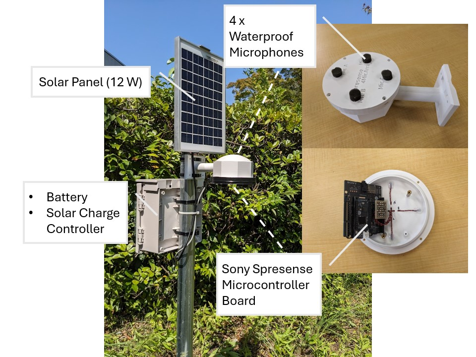
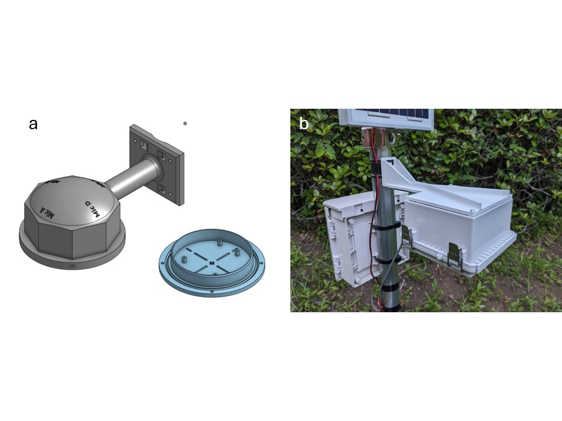
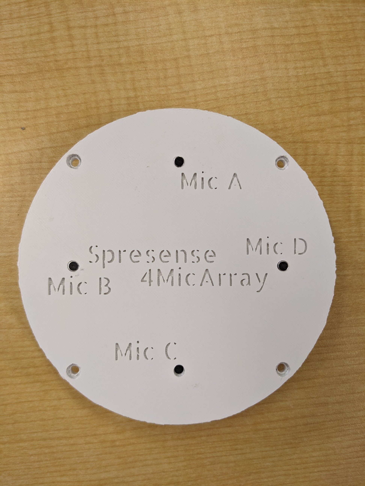
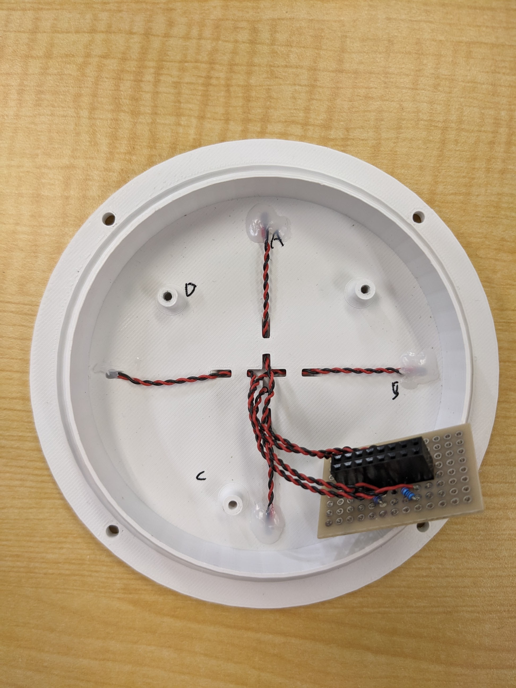
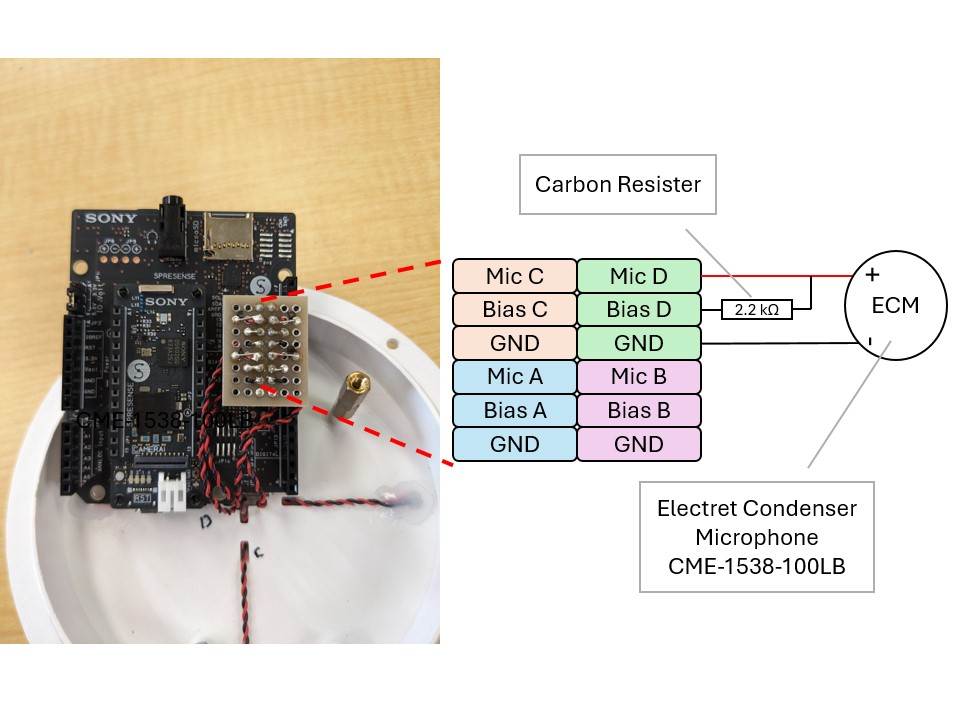

# `ChirpArray`: a low-cost, easy-to-build microphone array for long-term ecoacoustic monitoring 

## Overview

`ChirpArray` is a microphone array for outdoor recording projects.  
It utilizes Sony's Spresense microcontroller as a processing module.

## Features
- **Up to 4ch recording:**  
    `ChirpArray` has 4 microphones to enable sound source localization.
- **Flexible recording setting and scheduling:**  
    Plenty of options for various research projects:
    * Sampling rate (16 kHz ~ 192 kHz)
    * Channels of recording (monaural, stereo, 4 channels)
    * Audio codec (WAV or MP3)
    * Recording schedule (see below) 
- **Low power consumption:**  
    `ChirpArray` can run with a 12 W solar power system due to Spresense's low power features.
- **Automated time correction using on-board GNSS**
- **Low cost:**  
    The whole system with solar power system costs about $200.
- **Easy to reproduce:**  
    All parts are available online.  
    No professional skills are required to assemble `ChirpArray`.

## Parts list
### `ChirpArray`  
| product name | product type | manufacture | price | quantity |
| --- | --- | --- | --- | --- |
| Spresense Main Board | Main processing board | SONY | ¥6000 | 1 |
| Spresense Extension Board | Extension board for microphone inputs | SONY | ¥4000 | 1 |
| CME-1538-100LB | Analogue microphone | CUI Devices | ¥500 | 4 |
| 2.2 kΩ carbon resister | general resister |  | Under ¥10 | 4 |
| Stripboard (36 mm x 24 mm) | general stripboard |  | Under ¥100 | 1 |
| pin header (2 x 8) | general pin header |  | Under ¥50 | 1 |
| micro SD Card (512GB) | general micro SD card |  | ¥10000 | 1 |

### *Optional:* Parts Example for Solar Powered Applications
| product name | product type | manufacture | price | quantity |
| --- | --- | --- | --- | --- |
| SY-M12W-12 | Solar Panel (12 W) | SANYOOO solar | ¥2500 | 1 |
| SA-BA10 | Solar Charge Controller | DENRYO | ¥4000 | 1 |
| WP7.2-12 | Battery (12 V, 7,2 Ah) | Kung Long Batteries Industrial | ¥3000 | 1 |

## Hardware Assembling

### Water-proof enclosures
First, choose a case to house the Spresense. While we have published 3D models of cases that can be printed with a 3D printer, you can also use commercially available waterproof boxes for outdoor installations. If you opt for a commercially available case, select one with enough space to accommodate the Spresense Extension Board (at least 90mm x 90mm x 30mm). Commercially available cases tend to offer better waterproofing, so if you're installing the device near a pond or in a high-humidity environment, it might be better to go with a commercially available case.

### Placing microphones
Next, arrange each microphone at equal intervals around the circumference of an 8cm diameter circle. If you are using a printable case, attach the microphones as shown in the picture below, and route the wires inside the case. Seal the wire entry points with adhesive. If you are using a commercially available case, drill holes in the case to attach the microphones directly. We also provide a 3D model for a microphone mounting plate, which you can print and use with any cases (in `3Dprintables/off_the_shelf_cases/MicrophoneAdaptor.stl`). To avoid rain damage, please install the microphones on the underside of the case.

### Wiring microphones
Finally, wire the microphones. I recommend reading [the official tutorial](https://developer.sony.com/spresense/tutorials-sample-projects/spresense-tutorials/using-multiple-microphone-inputs-with-spresense) and [the hardware documentation](https://developer.sony.com/spresense/development-guides/hw_docs_en.html#_how_to_use_microphones) as well.
1. Attatch Sony Spresense to the Spresense Extension Board  
    See [here](https://developer.sony.com/develop/spresense/docs/introduction_en.html#_how_to_attach_the_spresense_extension_board_and_the_spresense_main_board) for more details.
2. Wire the microphones and bias resisters.

The pin assignment of the Spresense Extension Board is shown as below. Follow the "Analogue" microphone placement and wire each microphone.  Make sure that each microphone is connected to the correct location.

>https://developer.sony.com/spresense/development-guides/images/HW_Mic_placement_E.png

### *3D models*
The 3D models were designed using Onshape and free to use and modify. See [the Onshape document](https://cad.onshape.com/documents/03e8f32e7241855707f43321/w/463fb24775ae6009ebde1d43/e/08f62e0ab2deafdc8f3bd898?renderMode=0&uiState=667e794788fb99170249fb00).

## Software Installation
1. Installing ArduinoIDE   
2. Setting up your Sony Spresense   

>For Step1. and 2., please refer to the [official tutorial](https://developer.sony.com/spresense/development-guides/arduino_set_up_en.html).

3. Setting recording options  
See [the Arduino Sketch](Arduino/timelapse_recorder/timelapse_recorder.ino) for more detail.    
You can set recording schedule, channels of recordings, sampling rate, and audio codec.

## How can I choose batteries and micro-SD cards?
See the article for more detail (*Preparing)
